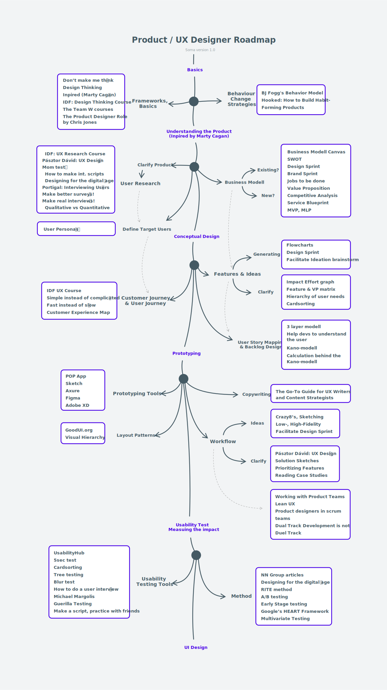

Marty Cagan Inspired című könyve óta tudjuk, hogy a roadmapok mégse segítenek annyira a terméktervezésnél. Én azért csináltam egy tanulósat magamnak.
{: .lead}
<!--break-->

## Előzmények
Abból kiindulva, hogy pszichológusnak is azok mennek, akiknek valami bajuk van magukkal. Én is valahogy ez alapján csináltam roadmapot. Bajom volt az itthoni tanulással. Kellett valami iránymutatás, egy folyamatábra, amin lépkedhetek a Product Design tapasztalatszerzés közepette. Ha ez másoknak is tud segíteni akkor az pedig plusz win.  
Lehet még ráadásként egy folyamat vázlatot is ad a kép, de ezt elég szabadon kell értelmezni.

Ihletnek itt volt Togi Sergey <a href="https://github.com/togiberlin/ui-ux-designer-roadmap" target="_blank">Designer Roadmapja</a>. Ő külön szedte a UI és a UX Roadmapokat, nagyon hasznos kis anyag, érdemes átfutni! 
Tovább voltak különféle front-end és back-end fejlesztős <a href="https://github.com/kamranahmedse/developer-roadmap" target="_blank">roadmapok</a> is. 
Na jó... ezeket azért erősen testre szabtam, egyszerűsítettem. 😉

## Használat
Linkeket nem tettem bele, habár SVG képként töltöttem fel. A bekeretezett szövegek általában cikkeknek néha kurzusok címei. De van még sok módszer, technológia, módszertan is felsorolva. 
Ezeket vagy ismered vagy nem, ha nem akkor érdemes rájuk guglizni és beleásni magad a témába. Ez tehát nem egy tanterv, inkább irány mutatás, hogy miket érdemes átnézni, mikbe érdemes jobban beleásnunk magunkat. És akkor elég a beszédből, katt rá és nézd nagyba! (SVG jeeee 💪)

## Roadmap v1.0

Képek: Pexels
