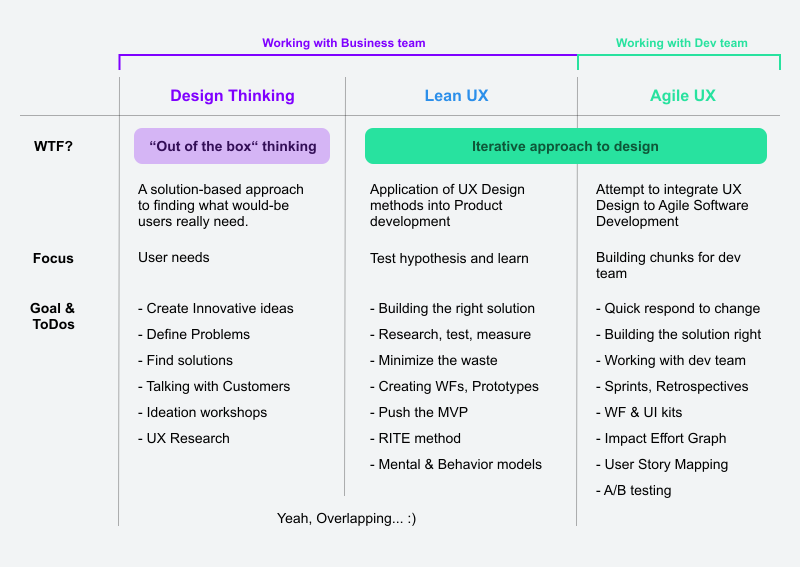
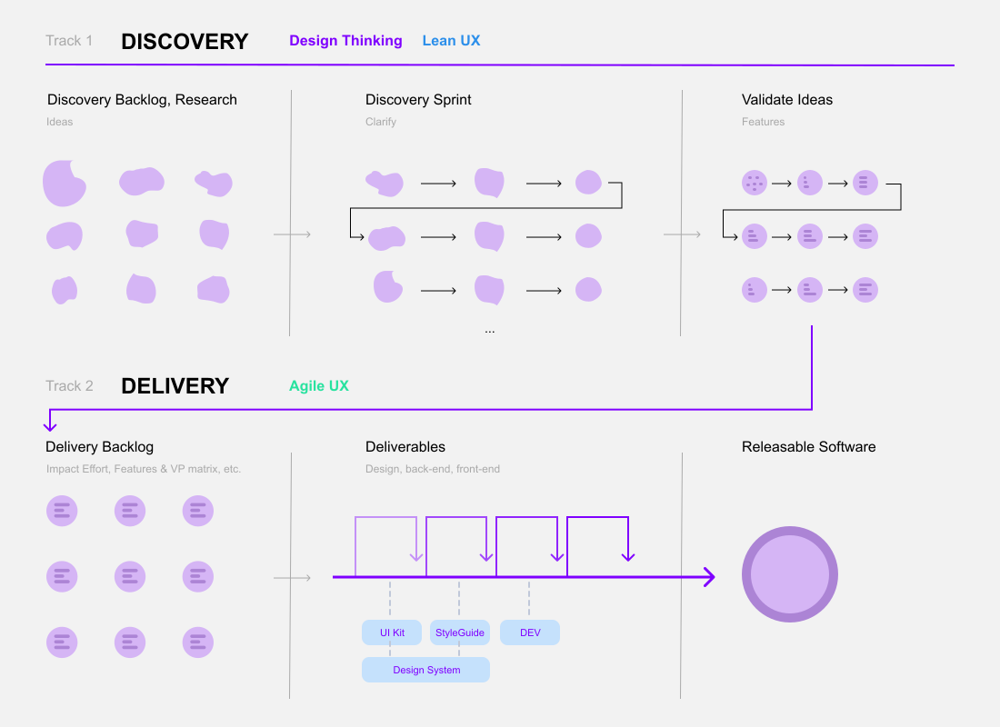

Az elmúlt időszakban többször megpóbáltunk újabb folyamatokat kipróbálni a termékfejlesztésben. Ezen kívül folyamatosan keresem én is az új ötleteket. Most valami mix van a fejemben Design Thinking Agile és Leanből.
{: .lead}
<!--break-->

## Előzmények
Az Amuse konferencián beszélgettünk PM-ekkel, designerekkel arról, hogy mik a folyamataik, de nagyjából ugyanaz jött le, mint ami a Youtube videókból, cikkekből:

> "Mindenki csak keresi az utat, cikkezik róla, hogy épp mit próbálnak ki. Implementálnak új keretrendszereket, de nincs tankönyvi megoldás."

Minden szervezetben, minden csapatban más és más termékfejlesztési folyamat működik hatékonyan. Ezért nincs itt egyetértés és egy bevált módszer, de ez valószínűleg így is van jól.  
Nagyjából alakulóban van a fejemben a következő folyamat, amit ki lehetne próbálni. Ez erősen elméleti és nem volt tesztelve. Össze gyűjtöttem a módszertanokat és megpróbáltam egybe gyúrni, így jött létre valami *dual track* szerű folyamat. 

## Részei

### Design Thinking
Először is az alapja a Design Thinking. Ezt nagyon jól leírta az <a href="https://www.interaction-design.org/literature/topics/design-thinking" target="_blank">Interaction Design Foundation</a>, kurzusuk is van belőle. Biztosítja az “Out of the box” gondolkodásmódot és hogy új, menő ötleteket generáljunk. Ez egy nagyon klassz módszertan, viszont erősen elméleti szintű. Nem ad semmi kézzel foghatót, csupán egy felfogást.
Példának okáért itt egy videó, ami tök jól személelteti ezt :)

<iframe width="560" height="315" src="https://www.youtube.com/embed/QlLEhCEOOSE" frameborder="0" allow="accelerometer; autoplay; encrypted-media; gyroscope; picture-in-picture" allowfullscreen></iframe>

A Design Thinking egy megvalósítási módja a Design Sprint, ami arra sarkall minket, hogy viszonylag gyorsan viszonylag sok új ötletet és megoldást generáljunk egy adott problémára. Viszont a 4-5 napos design sprintekből azért ne vonjunk le messzemenő következtetéseket egy termék további jövőjéről. Ennyi idő alatt nem lehet megváltani a világot, ezt arra találták ki, hogy egy átfogó képet kapjunk egy termékről. Egy fontosabb funkcióról elkészítünk egy prototípust, amit tesztelünk és nagyjából ennyi fér bele. A Design Sprintet 🏃 nagyon felkapta a szakma, divatos lett és lehet, hogy túl sokat várunk tőle! Kezeljük fenntartásokkal.

### Lean UX
A Lean UX természetesen a Erik Ries Lean szemléletéből nőtte ki magát a UX-es szakmában és főleg Jeff Gothelf nevéhez kötjük. Alapelve, hogy kicsit háttérbe szorítjuk a szállítandó UX munkákat és jobban koncentrálunk a probléma megértésére, megoldás elkészítésére és tesztelésére.

> “Lean UX is where prototyping shines. As with the initial sketches, focusing the prototype on critical components of the experience is essential.” – Jeff Gothelf, Smashing Magazine

Az agyalós szakasz ezekből a lépésekből állhat:
- Kutatás
- Ötletelés
- Mentális modellek kialakítása
- Vázlatok
- Storyboardok

Fontos részét képezik a hipotézisek és ezek tesztelése. Ebből aztán elkészülhet az MVP (Minimum Viable Product), ami akár csak egy landing page is lehet. <a href="https://www.justinmind.com/blog/complete-guide-to-lean-ux/" target="_blank">További infó itt!</a>

### Agile UX
A két megközelítés kicsit más eredményt szül: az Agile UX egy sokkal csiszoltabb terméket szállít, a Lean UX inkább több csiszolatlan “gyémántot”. Végül mindkét megoldás eredményezheti ugyanazt a jó terméket, csak különböző utakon és iterációkon át eljutva. Agile UX-ben a fejlesztők és a designerek szorosan együtt dolgoznak (egymás öldöklése nélkül...tényleg!). Így a termékfejlesztés szempontjából egy nagyon dinamikus és hatékony munkafolyamatot alakíthatunk ki. Design szempontból bevonhatjuk a fejlesztőket is a tervezés folyamatába. Ahogy egyre több időt töltünk el együtt a fejlesztőkkel, mi designerek is átlátjuk majd a fejlesztési korlátozásokat és fordítva. A fejlesztők is találkozhatnak egy-egy userrel, user problémával a kutatás fázisában.

## Track 1: Discovery 🤔
Alapesetben onnan indulnék ki, hogy a termékünkhöz megvannak az alap UX eszközeink: perszónák, user és customer journey-k, value proposition, stb. stb. Optimális esetben a Discovery fázis kb 2 héttel is a Delivery előtt jár.

A termékfejlesztői csapat állhat PO-ból, PM-ből, CMO-ból, UX-esből, CEO-ból stb. Nagyon klassz, ha a CTO és egyéb fejlesztők is be tudnak csatlakozni néha. Eddigi munkánkat mindig nagyon jó feedbackekkel és igényekkel támogatták az ügyfélszolgálatosok is, hiszen ők azok, akik rendszeresen kapcsolatban vannak az ügyfelekkel. 
Talán a legfontosabb, amit ki kell emelni minden előtt az a kommunikáció. Ezt nekem is még tanulni kell, konfrontálódni, megosztani az ötleteket és figyelmesen meghallgatni a többiek ötletét is. Közösen agyalni és igen, **néha az egónkat elnyomva haladni tovább.**

**Discovery Backlog, Research** 
Az első út a kutatás, nálam ez egy csendes, agyalós és hosszú folyamat. Nem mindig lehet erőltetni az ötleteket. Olyan mint a művészet, nem sajtolhatod ki magadból, hogy *“márpedig 4 új feature ötletet hozok holnap”* ...majd jön magától. Néha este, néha sörözés közepette, néha meetingeken jönnek a legjobb gondolatok.
 
**Discovery Sprint** 
A discovery meetingekre hozzuk el az új ötleteket, lehetséges megoldásokat, hipotéziseket és közösen vitassuk meg őket. Az se baj ha nincs. Volt már olyan esetem is, amikor konkrét Design Sprint módszerekkel mentem neki egy-egy hipotézisnek. Kíváncsi voltam mit hoz ki a csapat egy Crazy8’s-el vagy Solution Sketch-el. Nem volt rossz ötlet elég jó megoldások születtek, tudom ajánlani. 
Általában egy óra ötletelés és egy jó kis lista/jegyzet után wireframe készítés következik. Azért nevezem ezt is Sprintnek, mert egy-egy ötleten nem elég egy meeting ideje alatt dolgozni. Van amit 1 nap alatt kipörgetünk és van, hogy valamire csak a következő héten térünk vissza, hagyjuk ülepedni a dolgot. Néha még plusz problémák is felvetődnek, amikhez kutatunk kicsit, hátha okosabbak leszünk. Amihez csak lehet, próbáljunk meg felhasználói interjúkat is készíteni. Nyilván apróbb vagy korábban tesztelt ötleteknél ezt kihagyjuk, szerintem nem kell mindenhez, de mindenképp hasznos és fontos dolog nagyobb feladatok, döntések előtt! További infóért olvasd el a Mom test című könyvet! 
A design folyamat mindig wireframezésből és feedback adásból áll. A végén pedig egy prototípus születik.

**Validate Ideas** 
Optimális esetben a poolból már leegyeztetett felhasználói teszt időpontok vannak, hogy tesztelhessük mit alkottunk. Építsünk új mentális modelleket ha kell. Végezzünk Card Sortingot, 5mp-es tesztet az ügyfelekkel. Romboljunk le korábbi feltevéseket! Próbáljuk észben tartani *Hick törvényét* és egyszerűsítsük le a döntési folyamatokat. (ez nagyon érdekes téma, később egy másik postban kifejtem). 

Szerintem a <a href="https://uxmag.com/articles/the-rite-way-to-prototype" target="_blank">RITE</a> metodológia elég jól használható. A lényege, hogy a rendelkezésünkre álló kb. 6 felhasználót osszuk fel kettesével. Én még rangsorolnám is őket, hogy a legrelevánsabb userek maradjanak a legutolsó körre. Minden 2. teszt után vonjuk le a következtetéseket és javítsuk a hibáinkat, így menjünk neki a következő 2 tesztnek. 
A felhasználói tesztek és pár kör iteráció után jobb esetben készen lett egy validált feature igény, amit átdobhatunk a "második útra", a fejlesztési fázisba.

Eddig tartott kb. a Lean design folyamatunk, most pattintsuk át az agyunkat Agile UX-be és folytassuk a munkát a fejlesztőkkel. ☝️

## Track 2: Delivery 👨‍💻

**Delivery Backlog** 
Amíg a fejlesztésre váró ötleteink várakoznak, elkezdhetjük rangsorolni őket.
Az Impact Effort táblázat elég jó segítséget nyújthat ebben. Lényege, hogy helyezzük el a feature-öket egy 2x2-es mátrixban ezek alapján:
- Alacsony befektetés - Magas hatás
- Magas befektetés - Magas hatás
- Alacsony (erőforrás) befektetés - Alacsony hatás (a felhasználói élményre)
- Magas befektetés - Alacsony hatás

Ezt a workshopot pl. a PM / PO facilitálhatja. Talán a legjobb, ha ezt az eredményt is olyan agilisan kezeljük, mint a designt. Tartsuk fenn a változás jogát. A kategorizálás után mindenki döntse el maga, hogy milyen sorrendben fejleszt! 😉 
Létezik már egy pontosabb táblázat is, ami 3x3-as és egy középső értéket is tartalmaz.

**Deliverables** 
Az izgalmas részek most jönnek. 🙃  
Ha épp új terméket fejlesztünk akkor itt az ideje, hogy elkezdjünk használható UI terveket faragni a wireframjeinkből. Ezzel együtt belekezdünk egy Design System létrehozásában is, ami majd tartalmazza az arculatot, UI kit-et, Style Guide-ot. 
Design Systemhez erősen ajánlott tisztában lenni az Atomic Design módszertanával. Ezt <a href="http://atomicdesign.bradfrost.com/chapter-1/" target="_blank">Brad Frost találta ki</a> és már nem újkeletű dolog. Lényegében arról szól, hogy hogyan építsük fel a legkisebb atomokból a termék designunkat.
1. Atomok - Gomb, Ikonok, Színek stb.
2. Molekulák - Egy tab, egy egyszerű login form stb.
3. Organizmusok - Header, Footer, termékkártya stb
4. Templates - Előzőekből összeválogatott wf szerű sablon oldal
5. Oldalak - Kész kreatívok

Az így felépített és egymásba linkelt tervekben nagyon könnyen tudunk módosítani. Egy szín vagy ikon cserénél elég csak a megfelelő atomot módosítani és az egész termék tervben módosul a látvány. Fejlesztői és design időből is 10-20%-ot is megspórolhatunk egy jól működő rendszerrel. Figma-val, Sketch-el és a többi komponenseket támogató szoftverrel is létrehozhatunk DS-t. 
A kész UI kitből a front-end Style Guideot, CSS libraryt készít, hogy nekik is egy moduláris eszköztárból kelljen csak behúzni a későbbi fejlesztendő dolgokat.

Ha meglévő terméket fejlesztünk egyszerűen csak a meglévő Design Systemből építkezünk. A kész tervekkel itt is iterálunk: egyrészt a business-el, másrészt a fejlesztőkkel a megvalósíthatóság végett.
Szerencsésebb esetben a gyors moduláris designnak köszönhetően még maradhat időnk egy utolsó hi-fi tesztre (A/B-teszt, 5mp, kisebb logikai hibák javítására). Tesztelni sose késő! 🙃 Ha pedig bejönnek új design elemek, hozzá csapjuk a meglévő DS-hez és commitolunk.

És végül ha fix egy terv: csak tegyük le a fejlesztők barlangja elé és rohanjunk ki a szobából! 😘

[^1]: Footnote valami csoda