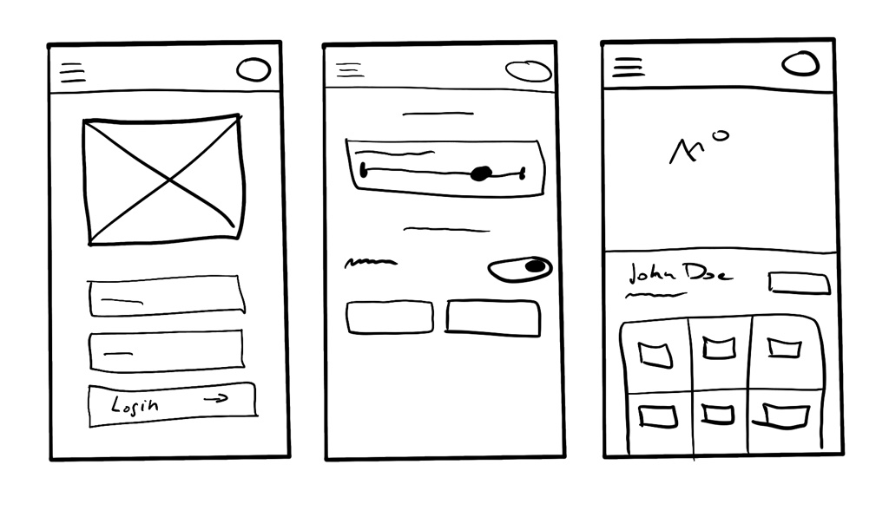
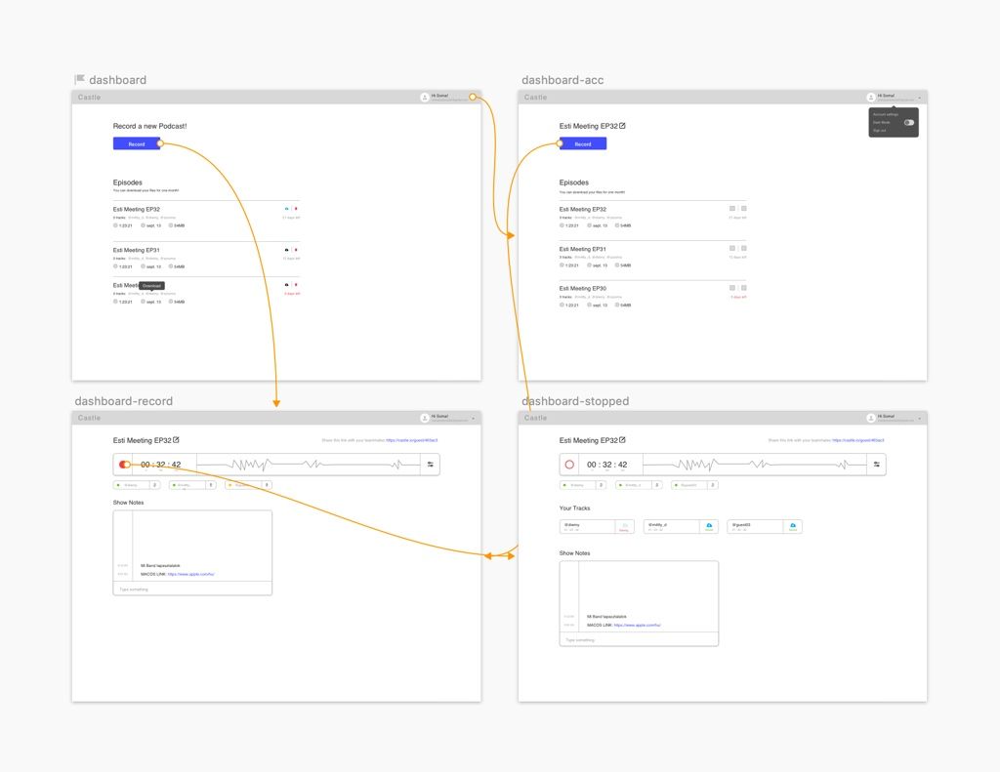
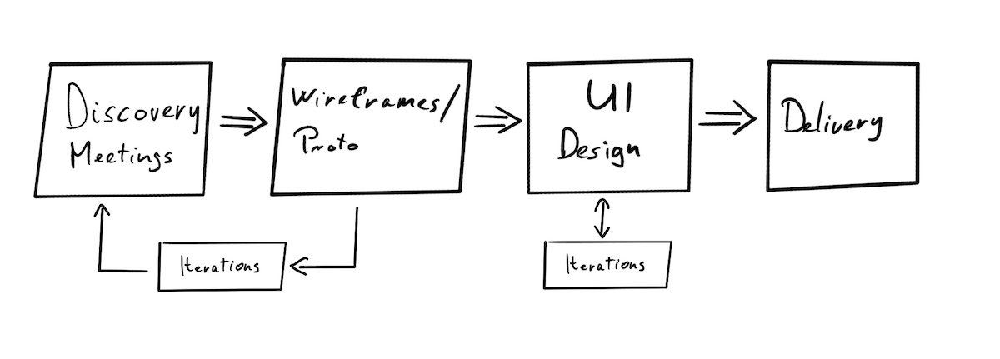
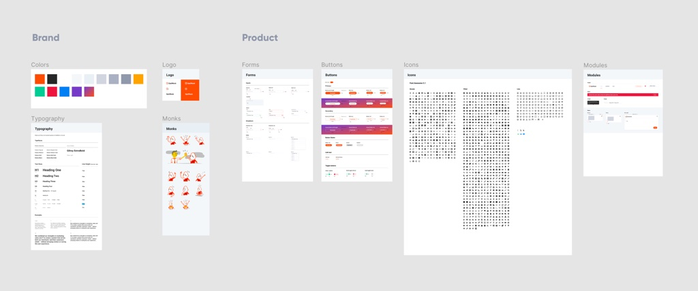

Pár hete egy szűk csapathoz volt szerencsém becsatlakozni egy sörre. Egy debreceni business rendezvény alapjait fektették le és közben persze be kellett mutatkozzak, mivel 3 emberből 2-őt egyáltalán nem ismertem. 🙂
{: .lead}
<!--break-->

Jogosan vetődik fel a kérdés, hogy mi köze van a címnek a bevezető szöveghez?

...Természetesen semmi, csak kontextusba szerettem volna helyezni a történetemet. Nagy híve vagyok a “mindent kontextusában vizsgáljunk” dolognak!

Szóval a bemutatkozásom alkalmával kiderült, hogy UX-szel is foglalkozok és meglepődve tapasztaltam, hogy bizniszben meglehetősen otthon lévő partnerem nem igazán hallotta még ezt a kifejezést sőt a drótvázazás témakörét is körbejártuk.

## Wireframe / drótváz

A drótváz gyakorlatilag az aminek tűnik első hallásra. 

>Egy weboldal vagy app alacsony kidolgozottságú vázlata. 

A kezdeti fázisokban akár papíron is születhet csupán négyzetek, körök és vonalak felrajzolásával. Az elrendezések próbálgatásánál használhatunk benne Lorem ipsum szövegeket, később pedig beilleszthetjük a kész szöveg elemeket.

Egy drótváz tehát választ ad az oldallal kapcsolatos Mi? Hol? Hogyan? kérdésre Így segítve a designernek és az ügyfélnek egyaránt. Egyrészt jó az ügyfélnek mert gyorsan, már a tervezés egy korai fázisában láthat egy körülbelüli elrendezést és kontent tervet a jövőbeli oldalára / appjára, másrészt jó a designernek, mert nem egy kész terven bukik ki, hogy az ügyfél számára mégis inkább egy teljesen más layout lenne megfelelő.

Skiccelni elég sokféleképpen lehet. Kezdésnek egy papír ceruza simán megteszi.

Következő fázisban pedig használjunk egy szoftvert rá:

*   Sketch (100$ / év): ipari standard lett az elmúlt években, rengeteg kész moduláris wireframe kit közül választhatunk és a Sketch Cloudon keresztül prezentálhatjuk a stakeholdereknek. Nagy előnye, hogy a látványtervet is elkészíthetjük benne.
*   Figma (Freemium): a fenti feature-öket ez is tudja. Live-ban lehet kooperálni a design-on. Előnye és egyben nagy hátránya, hogy webapp (a desktop alkalmazás is electron alapú)
*   Adobe XD (Free): a fenti feature-öket ez is tudja. 
*   Axure (29$ / hó): Ez egy kicsit más tészta. HTML drótvázat és egy működő, kattintható kitölthető prototípust építhetünk vele.

## És mi van, ha terméket fejlesztünk?

Termékek fejlesztésénél is kiemelt szerepet játszik a drótvázazás és prototipizálás.
>A prototípus egy részben működő szimulációja a termékünknek vagy annak egy tesztelni kívánt funkciójának.

Termékfejlesztéseknél kiemelt szerepe van az alacsony kidolgozottságú prototípusoknak, wireframeknek, mert az idő pénz. Főleg, ha a mindig időhiányban küszködő dev teamet nézzük. Egy átgondolatlan ötletet lefejleszteni olyan luxus, amit nem sok csapat engedhet meg magának a rohanó világunkban.

Korábban írtam a [termékfejlesztési módszerekről](https://uithings.hu/posts/dual-track-design){:target="_blank"}, ahol a process nagyjából így néz ki:

Mondjuk ez minden rendes folyamatban így néz ki 🤓

A képlet bennem akkor változott meg, amikor nagyjából használható állapotba került a Figmával közös szerelemgyerekünk...az új Design System UI kit része. Erről egy következő cikkben részletesebben fogok írni! Stay Tuned! ☝️

## És mi van, ha van Design Systemünk?

Szóval elkészültem a DS 1.0-val. Bekerültek a logók, typók, buttonok, ikonok, formázott reszponzív boxok, modalok, form és más komponensek. Minden szépen elnevezve, kategorizálva, kimérve, komponensezve. Külön a UI kit, külön a prototípusok és külön a UI design. Ahh designer énem máris benedvesedett!

A process ugyan úgy folyt tovább, megbeszéltük az ötleteket, csinálok rá egy gyors prototípust és megnézzük hogy működne. Aztán iterálunk párat.

...Egy idő után viszont rájöttem, hogy a prototípus page-en konkrét UI-ok jelentek meg és összemosódtak a drótvázakkal. Egyszerűen nem volt értelme szürke négyzetekkel és körökkel wirreframezni, mert minden UI kész komponensem ott volt és csak be kellett húzzam az új tervre. Pixel pontos paddingokkal és méretekkel nem foglalkoztam, de prototípust már egy nagyon high-fidelity állapotban tudtam prezentálni a csapatnak. Arról már nem is beszélek, hogy user teszteken szintén sokkal praktikusabb, ha a prototípusunk élethűbb, hiszen jobban bele tudják képzelni a kontextusba magukat a teszt alanyaink.

A design systemünk természetesen meg van osztva a csapat többi részével is, tehát ők is tudják használni az ötleteik prezentálására. Eddig csak jó tapasztalataink vannak. Mások is - akik nem designerek - össze tudnak illeszteni kisebb UI kész felületeket, hiszen csak be kell húzni a komponenseket az artboardra.

A wireframezés tehát megmaradt a papír stádiumban skiccként. Én egyre kevesebbet használom a klasszikus elnagyolt, szürke négyzet formákat. Az új rendszerben egyből képesek vagyunk kialakítani az arányokat is, ha épp szükséges. A “drótvázazásba” fektetett időt nem rövidítettük le, de a UI-hoz mostmár csak finomítások szükségesek. Például a paddingok, méretek, színek tisztázása és a prototípus linkek megtervezése kell, hogy mehessen reviewba.

## Konklúzió:

A hagyományos wireframezés jó és szükséges, ehhez kétség sem fér. Segítségével lehetőségünk nyílik feltárni a kezdeti bakikat, logikátlanságokat, amiket ha benne hagynánk a tervekben sok időt vesztenénk.

*   Ezen kívül segít kitalálni a kezdeti layoutot és struktúrát
*   Az információs hiearachiát
*   Az egyszerű szürke alakzatos drótváz segít a felhasználói élményre fókuszálni,
*   és letisztázni a feature igényeket
*   Időt spórol

Az egész **elmélkedésem**, hogy akár ki is válthatjuk high fidelity tervekkel, az **arra vonatkozik, ha épp egy UI Kittel rendelkező terméket fejlesztünk!**

Ha tehát ti is lusta designerek vagytok, építsetek design systemet, hogy magas kidolgozottságú wireframeket használhassatok. 

*   Jó a terméketeknek, mert egységesíti a kinézetet
*   Gyorsítja a UI tervezést
*   Magas kidolgozottságú prototípusokkal tesztelhettek különösebb időbefektetés nélkül
*   A többiek elvégezhetik a munkát helyetted☝️

Hamarosan jelentkezem a mi design systemünk bemutatásával. Stay tuned! 💪

Borítókép forrása: Pexels
