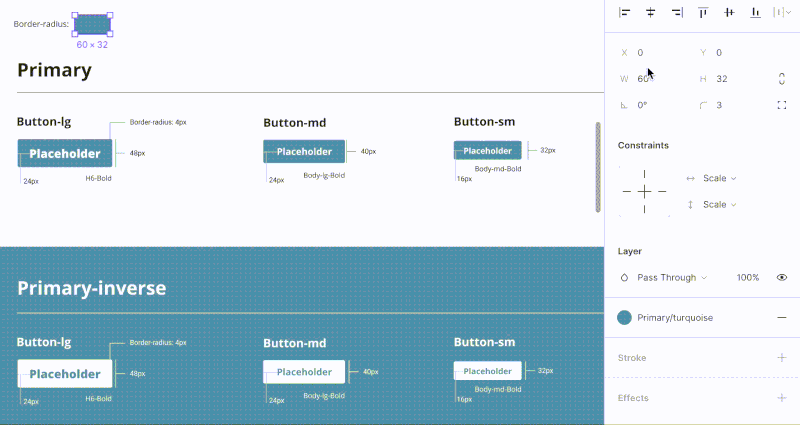
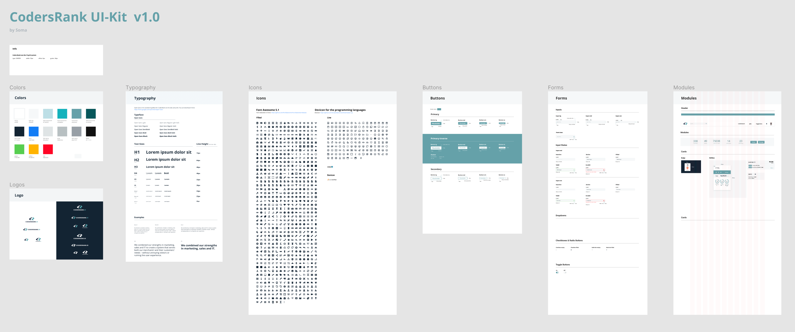

Két hete kezdtem el dolgozni a CodersRank.io-nál és az első dolgunk az volt, hogy elkezdtünk építeni egy UI Kitet, hogy könnyítsünk és gyorsítsunk a jövőbeli munkákon. Erről tartok most egy kis beszámolót!
{: .lead}
<!--break-->

# Komponens 📦
A számítógépek fejlődésével a szoftver programozásban egyre nagyobb káosz kerekedett. A fejlesztők sorra vesztek el a sok egyedi kódrészletben mígnem Douglas McIlroy 1968-ban bemutatta a komponens alapú programozást. A komponensek újrafelhasználható kódrészletek, amik felgyorsították a fejlesztéseket. 

A szoftver design iparban is valami hasonló zajlott le az utóbbi években. A komponenseket már ismertük az újhullámos design szoftverek előtt is, hiszen a Photoshop Smart Object-jei már tulajdonképpen komponensek voltak. Mégis a nagy változást a 2010-ben megjelent **Sketch** hozta el. Sokkal nagyobb hangsúlyt fektettek a komponens alapú designra ezért a software népszerűsége ugrásszerűen nőtt lassan veszélyeztetve a Photoshop egyeduralmát a webdesignban. 

Mivel a Photoshop nem webdesign eszközként született, egy csomó mindent meg lehet vele oldani, amit amúgy front-end szempontból nem…

> “It is possible to design impossible things.” - Adobe Photoshop

A Sketch, - és akkor említsük meg most már a többi eszközt is - **Adobe Xd, Figma, UX Pin** stb. ilyen szempontból sokkal korlátoltabbak, kevesebb az esélye, hogy elszabadul a designer és lehetetlen dolgokat tervez. 

# Na de a UI Kit!
Pár évvel ezelőtt összeszámoltam a ShopRenter által használt gombokat. KB 15 féle gomb volt a domain alatt. Mit ad a UI kit? Nagyjából az első mondat választ ad erre: konzisztens design-t egy termék fejlesztésénél.
A UI kit előre definiált, komponens alapú rendszer, ami minden olyan design elemet tartalmaz, ami a termék fejlesztéséhez szükséges. Egy folyamatosan fejlődő rendszer, amivel foglalkozni kell és sosincs kész, mivel a termék sem nyilvánítható késznek. 

Egy működő UI kit és a mögötte lévő rendszer sokkal inkább hasonlít egy software fejlesztéshez, mint egy hagyományos design munkához.
- Kialakításánál együtt kell dolgoznia designernek, fejlesztőnek és stakeholdernek.
- Folyamatosan karban kell tartani
- Menedzselni kell a verziókat és változásokat, hogy a fejlesztők is értelsüljenek a változásokról
- Ha több designer alakítja ki, akkor fontos a verzió követés és a backup.

Igazából egy önálló termékként kell tekinteni rá, ami a más termékek fejlesztéséhez használandó.
Hogy mik a pontos előnye és hogy hogyan fogj neki, azt nem én akarom elmondani! Ezernyi ilyen cikk van a neten és nincs kedvem ismételni őket. Inkább leírom a saját tapasztalataimat!

# Tapasztalatok
Viszonylag már benne vagyok a témában és teljesen más UI kittel tervezni mint nélküle. Sokan mondják, hogy így oda a kreativitás és a tervezői szabadság, ami valamilyen szinten valid, viszont a szerepek is cserélődnek. A designer most már nem csak azért felelős, hogy egy adott terv szép legyen és használható. Sokkal inkább egy problémára kell általában több megoldást és megközelítést találni. Ez sok időbe, gondolkodásba telik és nincs idő apróbb dolgokkal foglalkozni, mint pl. a paddingok kiszámolása vagy a gombok méretének meghatározása.  
Ezeket elég egyszer, a UI kit alapjainál definiálni és utána már csak be kell húzni az adott komponenst és átírni a placeholderét. Egy jó rendszerrel akár a [wireframezést is ki lehet váltani](https://uithings.hu/posts/wireframezes){:target="_blank"}. 

Design szempontból, amik kihívást jelentettek az a konzisztencia megtartása. Ha Brad Frost Atomic UI terminológiáját követjük akkor fontos, hogy az atomok körültekintően és jól legyenek megtervezve. 

 

<iframe width="100%" height="400px" src="https://www.youtube.com/embed/q5CB1za0NfA" frameborder="0" allow="accelerometer; autoplay; encrypted-media; gyroscope; picture-in-picture" allowfullscreen></iframe>

Sok apró dologra kell odafigyelni. Csak hogy egy példát említsek: a lekerekítések.  
Ezt én úgy oldottam meg, hogy létrehoztam egy négyzet objektumot, majd ezt komponensé varázsoltam. Az ezután következő atomok, molekulák stb, kb. minden ebből lett származtatva. Ez a gombok, az inputok téglalapja, a box, badge komponensek háttere, a képek maszkja is. Így ha egy későbbi redesignnál úgy döntünk, hogy minden legyen lekerekített, akkor csak az első kis téglalap atomot kell lekerekíteni és ezt követően minden változik vele. 
Ugyanez érvényes a színekre, betűtípusokra és az egyéb komponensekre.

A probléma ott kezdődik, amikor erre a kis trükkre azután jössz rá, hogy az összes primary, secondary, line és inverz gombot már megcsináltad… 🙄 Nem jó érzés, ha újra kell építeni mindent 😀  
Ha egy tanácsot megfogadtok tőlem: ne éles projekten csináljátok az első UI kitet! Inkább csak úgy magatoknak hobbiból kezdjétek el, mert könnyen túl fogtok szaladni a rászánt időn.

Én eléggé megszerettem az ezzel való tervezést. A kreativitásom nem igazán korlátozza, igazából a UI kit bővítésénél, optimalizálásánál élem ki az ilyeneket mostanában. Ha kíváncsi vagy jelenleg hogy áll a UI kit itt megnézheted:

# Tovább a front-end irányába 👨‍💻
A következő lépés, hogy a fejlesztők hogyan dolgozzanak belőle.

Ez egy újabb fura téma lesz. Pont nálunk gondoltam, hogy el kell kezdeni egyből gyártani a kód snippeteket és mennyire király lesz majd. Egyrészt igen, király lenne és el is kezdtem ismerkedni a [Storybook](https://storybook.js.org){:target="_blank"}-kal. 

 
<iframe width="100%" height="400px" src="https://www.youtube.com/embed/p-LFh5Y89eM" frameborder="0" allow="accelerometer; autoplay; encrypted-media; gyroscope; picture-in-picture" allowfullscreen></iframe>

Ez egy szuper eszköz, hogy a UI kitünket életre keltsük és a fejlesztők könnyen ki tudják másolni az előre megírt UI komponenseket. A felépítése egyszerű, bl oldalon a fa szerkezet, jobb felül a UI, jobb alul a kód. Az ebben szereplő elemek már kattinthatóak, kipróbálhatóak és bizonyos keretek között Storybookban tesztelhetőek is. 
Desinger szemmel kicsit melósabb szerkeszteni. Ismerni kell egy keretrendszert, hiszen így tudjuk felépíteni a komponenseket:
- React
- Angular
- Vue
Viszont ha egy kicsit érdekel mind a két terület (Design és Front-end) akkor nagyon is érdemes vele foglalkozni. Én ilyen vagyok pont 🤓

Példának okáért érdemes kattintgatni pár kész [Storybookban](https://storybook.js.org/docs/examples/){:target="_blank"}!

Szóval átbeszéltük a dolgot és végül arra jutottunk a fejlesztőkkel, hogy egyelőre nem igazán vagyunk olyan szinten, hogy erre megérje nekünk erőforrást fordítani. És igen ezt be kell látni, hogy nem minden világmegváltó ötletünk lesz elfogadva és implementálva. 

Jelenleg home projektként kell majd időt szakítani erre az eszközre, de nagyon tetszik. 

Folyt.köv.

<!--
## Link
[wireframezést is ki lehet váltani](https://uithings.hu/posts/wireframezes){:target="_blank"}

## Kép

## Képal áírással
|  |
|:--:|
| *
Képaláírás.
* |

## Info
Bibendum nulla sed consectetur.
{: .notice}

## Footnote
Valami[^1]

## Forrás:
A kép forrása

[^1]: Footnote valami csoda
-->